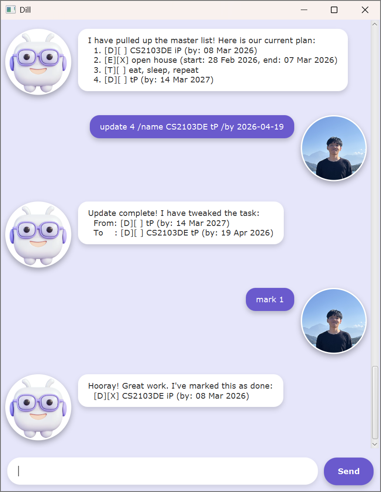

# Dill User Guide

Dill is a task management chatbot designed to help users reclaim their time. By providing a streamlined interface for tracking, organizing, and managing tasks, Dill transforms messy schedules into actionable plans, ensuring your most valuable resource is never wasted.

## Quick start

1. Ensure you have Java `21` or above installed in your computer.
2. Download the latest `.jar` from [here](https://github.com/weixuan01/ip/releases/tag/A-Release).
3. Copy the file to the folder you want to use as the *home folder* for Dill.
4. Open a command terminal, `cd` into the folder you put the jar file in, and use the `java -jar dill.jar` command to run the application.  

## Adding todos

Adds a todo task to the task list.  
Format: `todo <task-name>`  
Example: `todo eat, sleep, repeat`  
Dill replies with a success message if the todo task is added successfully.

## Adding deadlines

Adds a deadline task to the task list.  
Format: `deadline <task-name> /by <yyyy-mm-dd>`  
Example: `deadline assignment /by 2026-03-14`  
Dill replies with a success message if the deadline task is added successfully.

## Adding events
Adds an event task to the task list.  
Format: `event <task-name> /start <yyyy-mm-dd> /end <yyyy-mm-dd>`  
Example: `event art exhibition /start 2026-03-14 /end 2026-05-18`  
Dill replies with a success message if the event task is added successfully.

## Listing tasks
Lists all tasks currently in the task list.  
Format: `list`  
Dill replies with the list of tasks.

## Marking tasks
Mark a specific task in the list as done.  
Format: `mark <task-id>`
* `task-id` must be a positive integer.   

Example: `mark 1`  
Dill replies with a mark success message.

## Unmarking tasks
Unmarks a specific task in the list.  
Format: `unmark <task-id>`
* `task-id` must be a positive integer.

Example: `unmark 1`  
Dill replies with an unmark success message.

## Updating tasks
Updates a specific task in the list.  
Format: `update <task-id> <flag> <value> ...`
* `task-id` must be a positive integer.
* Supported `<flag>`: `/name`, `/by`, `/start`, `/end`.   
* Multiple flags can be specified in a single command to update multiple fields at once.  

Example: `update 2 /name cs2103de ip /by 2026-03-08`  
Dill replies with an update success message.

## Cloning tasks
Duplicates a specific task in the list.  
Format: `clone <task-id>
* `task-id` must be a positive integer.  

Example: `clone 3`  
Dill replies with a clone success message.

## Deleting tasks
Removes a specific from the list.  
Format: `delete <task-id>`
* `task-id` must be a positive integer.   

Example: `delete 4`  
Dill replies with a delete success message.

## Finding tasks
Filters tasks with names containing the specified keyword.  
Format: `find <keyword>`
* The search is case-sensitive.
* Only the task name is searched.  

Example: `find cs2103de`  
Dill replies with a list of matching tasks.

## Viewing tasks
Filters tasks occuring on the specified date.  
Format: `view <yyyy-mm-dd>`  
Example: `view 2026-04-01`  
Dill replies with a list of matching tasks.

## Getting help
Displays a user manual.   
Format: `help`  
Dill replies with a help message containing the list of available commands.

## Exiting the program
Terminates the program.   
Format: `bye`  
Dill replies with a farewell message.
